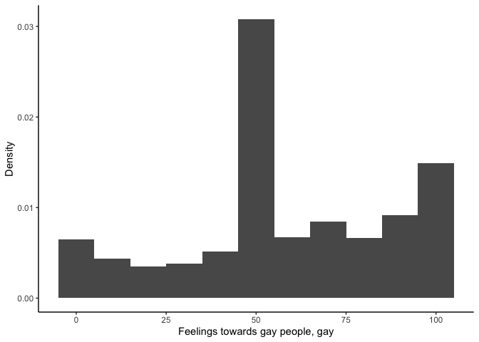
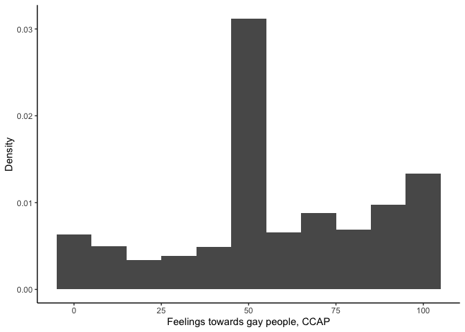
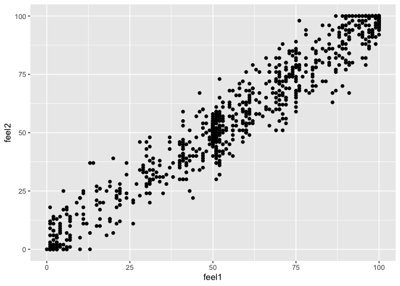
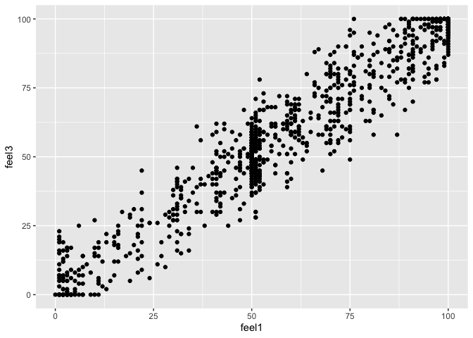
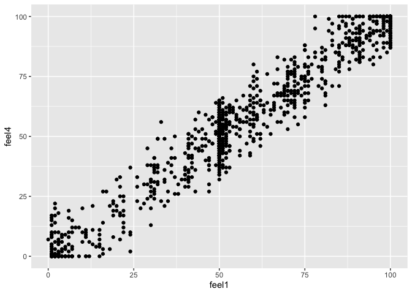
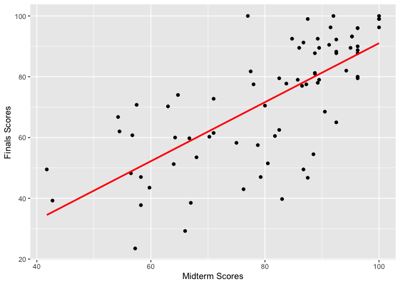

## B2 Homework

#### Evidence of Data Fabrication


```
## # A tibble: 6 × 5
##   treatment  feel1 feel2 feel3 feel4
##   <chr>      <dbl> <dbl> <dbl> <dbl>
## 1 No Contact     2     6     0     6
## 2 No Contact    91    90   100    93
## 3 No Contact    46    67    38    46
## 4 No Contact     6     0    NA    16
## 5 No Contact   100   100   100   100
## 6 No Contact    99   100    83    NA
```

```
## [1] 2441    5
```

```
##   feel
## 1  100
## 2    6
## 3   61
## 4   50
## 5  100
## 6   50
```

```
## [1] 43998     1
```

**Question 1**


```r
dens_gay <- ggplot(data = gay)
dens_gay <- dens_gay + geom_histogram(mapping = aes(y=..density.., x = feel1 ), binwidth=10)
dens_gay <- dens_gay + theme_classic() + xlab("Feelings towards gay people, gay") + ylab("Density")         
dens_gay
```

```
## Warning: The dot-dot notation (`..density..`) was deprecated in ggplot2 3.4.0.
## ℹ Please use `after_stat(density)` instead.
## This warning is displayed once every 8 hours.
## Call `lifecycle::last_lifecycle_warnings()` to see where this warning was
## generated.
```

<!-- -->

```r
dens_ccap <- ggplot(data = ccap)
dens_ccap <- dens_ccap + geom_histogram(mapping = aes(y=..density.., x = feel ), binwidth=10)
dens_ccap <- dens_ccap + theme_classic() + xlab("Feelings towards gay people, CCAP") + ylab("Density")         
dens_ccap
```

<!-- -->

Yes, the distribution of the data from the gay marriage experiment is almost identical to the distribution of the CCAP data.

**Question 2**


```r
gay %>%
  summarise(
            mean_feel1 = mean(feel1, na.rm = TRUE),
            median_feel1 = median(feel1, na.rm = TRUE),
            sd_feel1 = sd(feel1, na.rm = TRUE)
            )
```

```
## # A tibble: 1 × 3
##   mean_feel1 median_feel1 sd_feel1
##        <dbl>        <dbl>    <dbl>
## 1       58.6           52     28.6
```

```r
ccap %>%
  summarise(
            mean_feel = mean(feel, na.rm = TRUE),
            median_feel = median(feel, na.rm = T),
            sd_feel = sd(feel, na.rm = TRUE),
  )
```

```
##   mean_feel median_feel  sd_feel
## 1  58.09241          52 28.40383
```

Yes, the distributions of the two datasets are practically identical.

**Question 3**

I would expect that the baseline attitudes towards same-sex marriage would be more positive than the national average, such that the distribution was shifted more towards the right (towards 100) seeing as Los Angeles county is a more liberal area of the United States and thus not representative of the whole American population.

**Question 4**


```r
feel1v2 <- ggplot(data=gay[gay$treatment=="No Contact",])
feel1v2 <- feel1v2 + geom_point(mapping=aes(x=feel1, y=feel2))
feel1v2
```

```
## Warning: Removed 164 rows containing missing values (`geom_point()`).
```

<!-- -->

```r
feel1v3 <- ggplot(data=gay[gay$treatment=="No Contact",])
feel1v3 <- feel1v3 + geom_point(mapping=aes(x=feel1, y=feel3))
feel1v3
```

```
## Warning: Removed 148 rows containing missing values (`geom_point()`).
```

<!-- -->

```r
feel1v4 <- ggplot(data=gay[gay$treatment=="No Contact",])
feel1v4 <- feel1v4 + geom_point(mapping=aes(x=feel1, y=feel4))
feel1v4
```

```
## Warning: Removed 137 rows containing missing values (`geom_point()`).
```

<!-- -->

Yes, the respondents' answers are very similar over time. The error-minimizing line would be the 45 degree line although there is some random noise around it.

**Question 5**


```r
gay %>%
  filter(treatment=="No Contact") %>%
summarise(
  cor2 = cor(feel1,feel2, use="complete.obs"),
  cor3 = cor(feel1,feel3, use="complete.obs"),
  cor4 = cor(feel1,feel4, use="complete.obs")

)
```

```
## # A tibble: 1 × 3
##    cor2  cor3  cor4
##   <dbl> <dbl> <dbl>
## 1 0.973 0.959 0.971
```

The answers for the control group of feel1 are highly correlated with the answers to feel2, feel3 and feel4 with correlation coefficients above .95 in each case.

**Question 6**

Yes, there is evidence suggesting that the data used in the gay marriage experiment is fabricated.

### Predicting Course Grades Using Midterm Scores Part 1: Predicting Final Exam Scores


```r
grades <- read.csv("grades.csv")
head(grades)
```

```
##   midterm final overall gradeA
## 1   79.25 47.00    69.2      0
## 2   96.25 87.75    94.3      1
## 3   58.25 37.75    62.0      0
## 4   54.50 62.00    72.4      0
## 5   83.00 39.75    72.4      0
## 6   41.75 49.50    59.5      0
```

```r
dim(grades)
```

```
## [1] 76  4
```

**Question 1**

a) Each observation in the dataset represents a student, the variables reflect the specific student's performance in their class.

b) We will use the midterm test scores, i.e. `midterm` as our X variable. It is a non-binary variable as it kan take on values between 0 and 100.

c) As stated in the assignment title, we want to predict final exam scores and thus our Y variable will be `final`.

d) The correlation coefficient between the midterm test scores and the finals test scores is positive at .716


```r
cor_xy <- cor(grades$midterm,grades$final)
cor_xy
```

```
## [1] 0.7160323
```

**Question 2**

a) Calculating the fitted line


```r
fit <- lm(final <- final ~ midterm, data = grades)
fit
```

```
## 
## Call:
## lm(formula = final <- final ~ midterm, data = grades)
## 
## Coefficients:
## (Intercept)      midterm  
##     -6.0059       0.9704
```

```r
summary(fit)
```

```
## 
## Call:
## lm(formula = final <- final ~ midterm, data = grades)
## 
## Residuals:
##     Min      1Q  Median      3Q     Max 
## -34.789  -7.522   2.138   8.616  31.284 
## 
## Coefficients:
##             Estimate Std. Error t value Pr(>|t|)    
## (Intercept)  -6.0059     9.0133  -0.666    0.507    
## midterm       0.9704     0.1100   8.824 3.58e-13 ***
## ---
## Signif. codes:  0 '***' 0.001 '**' 0.01 '*' 0.05 '.' 0.1 ' ' 1
## 
## Residual standard error: 14 on 74 degrees of freedom
## Multiple R-squared:  0.5127,	Adjusted R-squared:  0.5061 
## F-statistic: 77.86 on 1 and 74 DF,  p-value: 3.581e-13
```

b) The fitted line is `final = -6.01 + .97*midterm`

c) The relationship can be visualized as follows:


```r
testscores <- ggplot(data=grades,mapping=aes(x=midterm, y=final) )
testscores <- testscores + geom_point() 
testscores <- testscores + geom_smooth(method="lm", se=FALSE, colour="red")
testscores <- testscores + xlab("Midterm Scores") + ylab("Finals Scores")
testscores
```

```
## `geom_smooth()` using formula = 'y ~ x'
```

<!-- -->

**Question 3**

a) My best guess would be using the conditional expectation, that is, conditioning on my midterm score of 80 points, my finals score would be 71.63 points.

b) If my midterm score is 90 points, then my final exam score will be 81.33 points.

c) An increase of 10 midterm points would result in an increase of 10\*0.9704=9.704 points on the final exam.


```r
y_80 <- -6.0059+0.9704*80
y_80 
```

```
## [1] 71.6261
```

```r
y_90 <- -6.0059+0.9704*90
y_90 
```

```
## [1] 81.3301
```

```r
delta_y_10 <- 10*.9704
delta_y_10
```

```
## [1] 9.704
```

Question 4


```r
R2 <- cor_xy^2
R2
```

```
## [1] 0.5127023
```

The R-squared is .51 and can be interpreted as the share of the variation in finals test scores that is explained by variation in mid term test scores. Similarly, it reflects how much better the linear regression model is at predicting finals test scores compared to taking the sample mean. Just above half of the variation in finals test scores can be explained by variation in the midterm scores.
